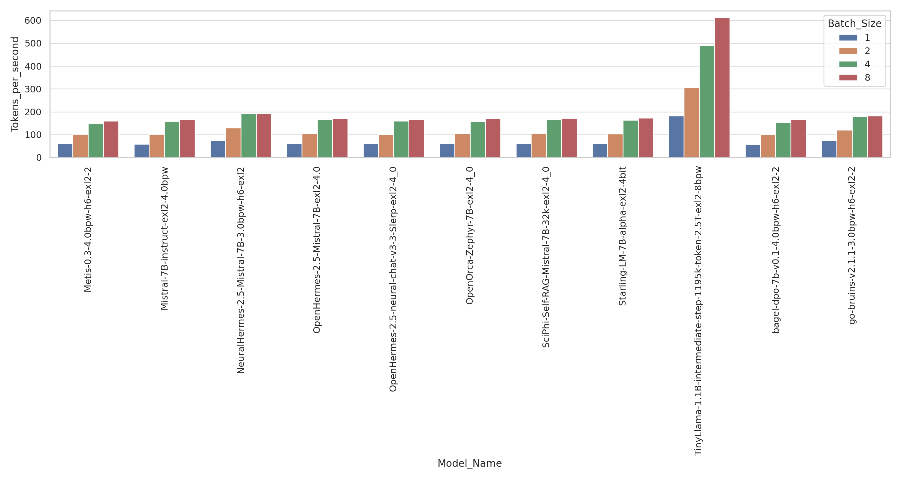
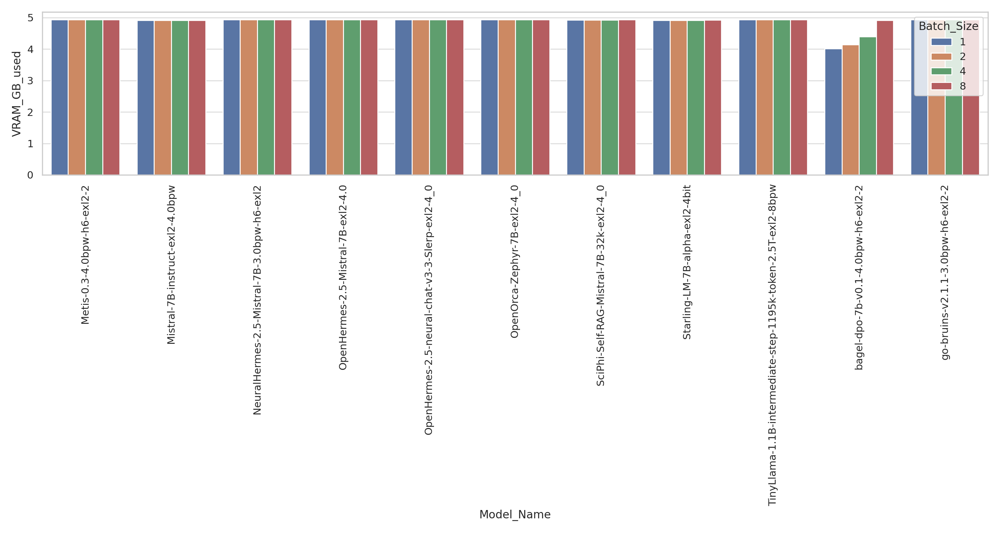
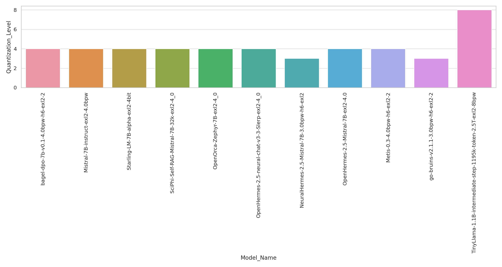
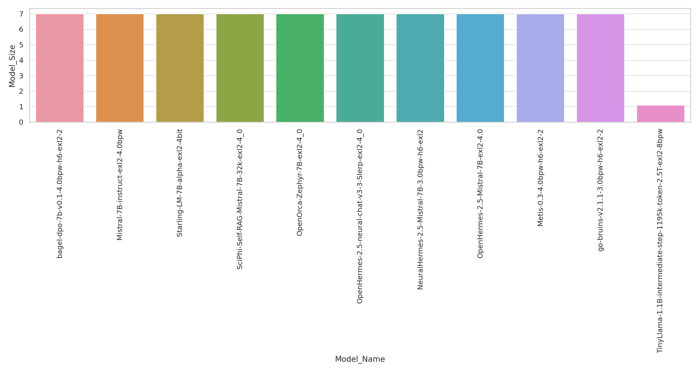

# exllamav2 Quantized Model Inference Performance Analysis

## Overview
This documentation provides a detailed analysis of the inference speed of exllamav2 quantized models, specifically tested on consumer-grade GPUs with limited VRAM capacity. The primary objective is to evaluate the performance of these models in a resource-constrained environment, making the findings particularly relevant for applications on cost-effective hardware setups.

### Experimental Context
- **GPU Used**: NVIDIA GeForce RTX 3060 with 12GB VRAM.
- **VRAM Limitation**: The VRAM was artificially restricted to 7.5GB. This constraint was applied to simulate the performance on an 8GB GPU, factoring in the VRAM reserved for system processes.
- **Model Focus**: The experiments concentrated on exllamav2 quantized models, known for their efficiency and compactness, making them ideal candidates for this analysis.

## Graphical Analysis

### Tokens per Second at Different Batch Sizes

This chart illustrates the number of tokens processed per second by each model. The data is segmented according to various batch sizes, offering insights into how batch processing impacts performance under VRAM limitations.

### VRAM Usage at Different Batch Sizes

The VRAM usage chart reflects the memory footprint of each model at different batch sizes. It highlights how effectively each model utilizes the limited VRAM, an essential factor for models intended for consumer-grade GPUs.

### Quantization Level for Each Model

This graph displays the quantization level applied to each model, showcasing the balance struck between model size and computational efficiency.

### Model Size (Parameter Count in Billions)

Representing the size of each model in terms of parameter count, this chart provides a perspective on the scale and complexity of the models under consideration.

## Model Repositories
Below are the Hugging Face repository links for each of the quantized models tested in this batch of experiments:

- [bagel-dpo-7b-v0.1-4.0bpw-h6-exl2-2](https://huggingface.co/LoneStriker/bagel-dpo-7b-v0.1-4.0bpw-h6-exl2-2)
- [Mistral-7B-instruct-exl2-4.0bpw](https://huggingface.co/turboderp/Mistral-7B-instruct-exl2.git)
- [Starling-LM-7B-alpha-exl2-4bit](https://huggingface.co/bartowski/Starling-LM-7B-alpha-exl2)
- [SciPhi-Self-RAG-Mistral-7B-32k-exl2-4_0](https://huggingface.co/bartowski/SciPhi-Self-RAG-Mistral-7B-32k-exl2)
- [OpenOrca-Zephyr-7B-exl2-4_0](https://huggingface.co/bartowski/OpenOrca-Zephyr-7B-exl2)
- [OpenHermes-2.5-neural-chat-v3-3-Slerp-exl2-4_0](https://huggingface.co/bartowski/OpenHermes-2.5-neural-chat-v3-3-Slerp-exl2)
- [NeuralHermes-2.5-Mistral-7B-3.0bpw-h6-exl2](https://huggingface.co/LoneStriker/NeuralHermes-2.5-Mistral-7B-3.0bpw-h6-exl2)
- [OpenHermes-2.5-Mistral-7B-exl2-4.0](https://huggingface.co/bartowski/OpenHermes-2.5-Mistral-7B-exl2)
- [Metis-0.3-4.0bpw-h6-exl2-2](https://huggingface.co/LoneStriker/Metis-0.3-4.0bpw-h6-exl2-2)
- [go-bruins-v2.1.1-3.0bpw-h6-exl2-2](https://huggingface.co/LoneStriker/go-bruins-v2.1.1-3.0bpw-h6-exl2-2)
- [TinyLlama-1.1B-intermediate-step-1195k-token-2.5T-exl2-8bpw](https://huggingface.co/zakoman/TinyLlama-1.1B-intermediate-step-1195k-token-2.5T-exl2)
